# hgamemini-图片隐写总结
## 复原图片尺寸


是一张看不出来任何文字和图像的乱码文字，可能是修改了图片的长和宽

通过010 Editor载入png模板，查看到图片的长和高
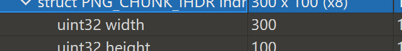
利用Python脚本计算正确的尺寸
```python
import os
import binascii
import struct

crcbp = open("xxx.png", "rb").read()    #打开图片
for i in range(2000):
    for j in range(2000):
        data = crcbp[12:16] + \
            struct.pack('>i', i)+struct.pack('>i', j)+crcbp[24:29]
        crc32 = binascii.crc32(data) & 0xffffffff
        if(crc32 == 0x38162a34):    #图片当前CRC
            print(i, j)
            print('hex:', hex(i), hex(j))
```
计算出图片原本的长和高，并修改，得到原图，注意路径使用转义字符。
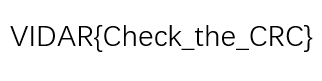
## 隐藏文件分离
观察图片，发现`jpg`文件过大，应该图片后面存在非`jpg`的二进制数据，保存在虚拟机里之后执行命令行
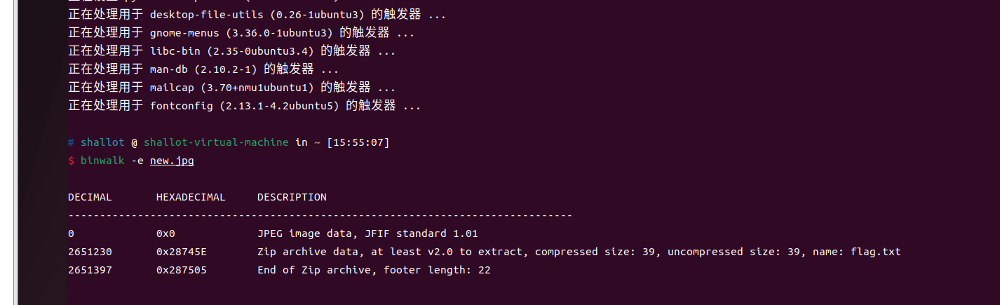
得到jpg里的压缩包文件
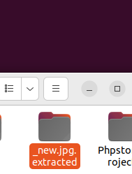

在第二题的相似思路中我们得到了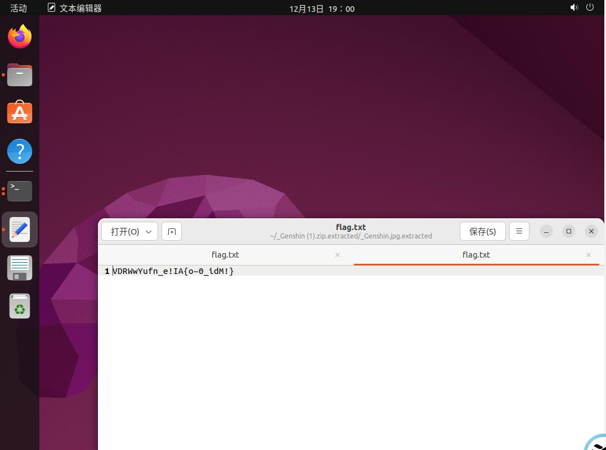
这并不是正确的flag,通过观察我们发现这串字符只是改变了顺序，考虑可能是栅栏密码。
通过解密得到flag。
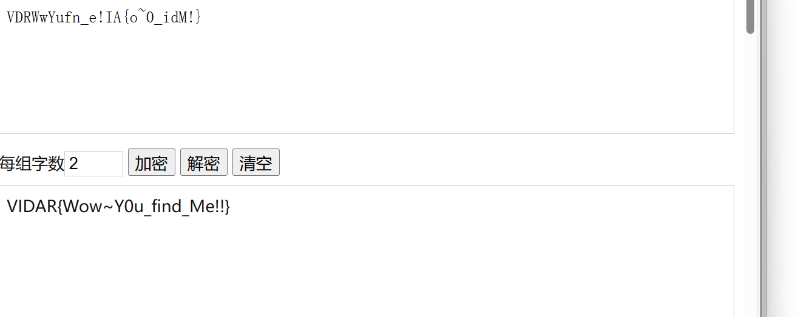
### lsb隐写
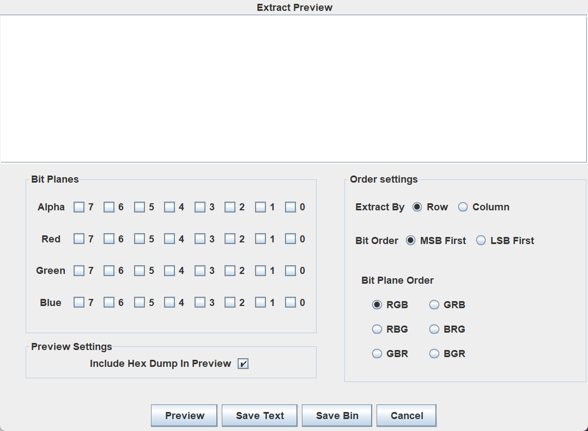
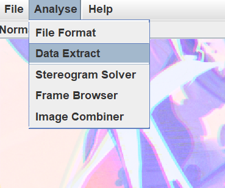
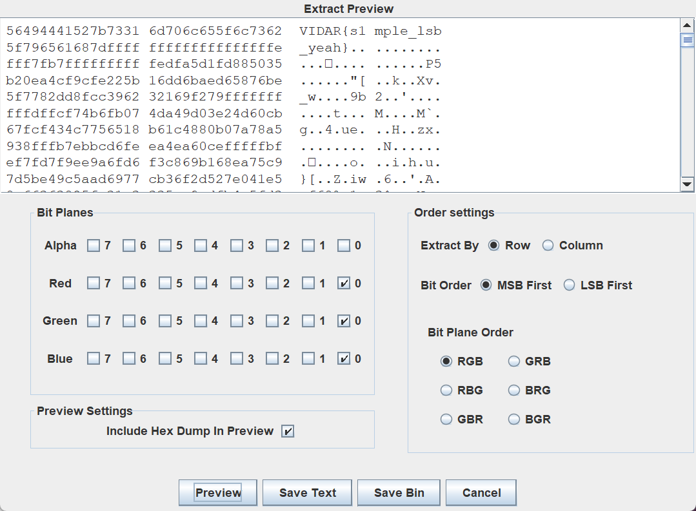
#### 魔数识别文件格式
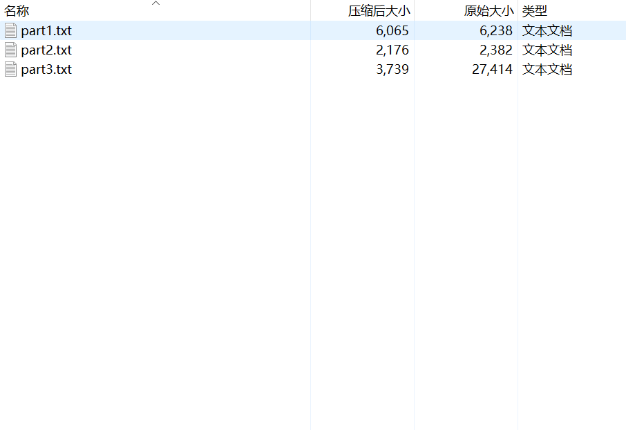
打开压缩包，发现有三个文本文件，打开也是乱码，猜测可能是不同格式的文件。打开`010editor`,查看魔数，修改后缀名，得到flag。
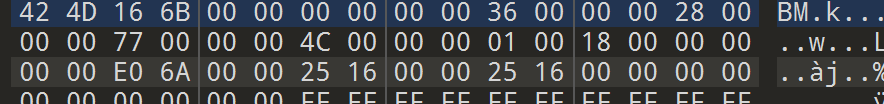
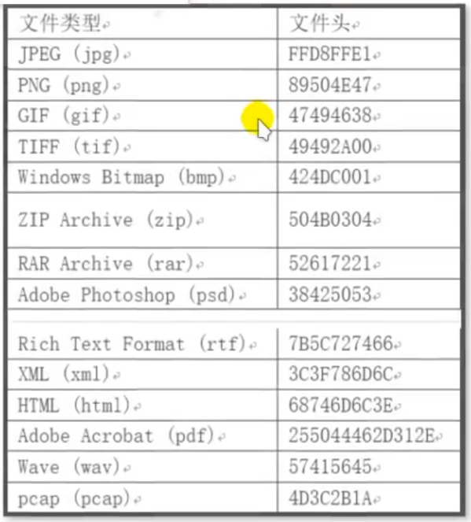


